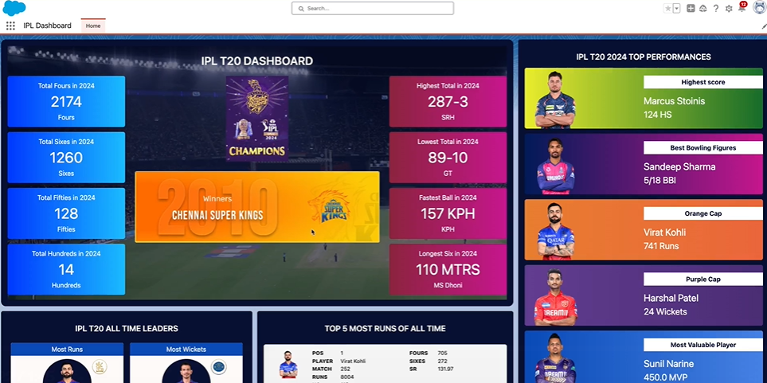

# 🚀 Salesforce Cricket IPL Dashboard 🏏

## 🧑‍💻 **Role: Salesforce Developer**

In this project, I worked as a **Salesforce Developer** and developed the **Salesforce Cricket IPL Dashboard** using **Lightning Web Components (LWC)**. I was responsible for the full development, integration, and deployment of the dashboard, ensuring real-time data fetching and seamless user interaction.

---

## 📜 Project Overview

Welcome to the **Salesforce Cricket IPL Dashboard** project! This is an **IPL T20 Dashboard** developed using **Salesforce Lightning Web Components (LWC)**. The dashboard provides real-time match statistics, player performances, team rankings, and match results. It was developed as a **Salesforce Developer**, and I was responsible for the full development, integration, and deployment of the dashboard.

---

## 🌟 Key Features

| Feature | Description |
|---------|-------------|
| ⚡ **Real-Time Data Integration** | Integrated external **REST APIs** to fetch live IPL match data, player statistics, and match scores, providing dynamic updates. |
| 🔧 **Dynamic Dashboard with LWC** | Built using **Salesforce Lightning Web Components** (LWC) for a responsive and interactive UI with smooth navigation. |
| 🔗 **Component Communication via Lightning Messaging Service (LMS)** | Used **LMS** to enable real-time communication and dynamic updates between components. |
| 🎨 **Custom Styling** | Applied **CSS** and **Salesforce Lightning Design System (SLDS)** to ensure a visually appealing and consistent design. |
| 💡 **Apex Integration** | Utilized **Apex** for backend logic to fetch and process live data, ensuring smooth integration. |
| 📊 **Real-Time Player Stats & Match Updates** | Dynamic updates on scores, player stats, and team rankings, providing live data without page refreshes. |

---

## 🛠️ Features Breakdown

### 1. **🏆 Dashboard Layout**
The dashboard consists of the following key sections:
- **🌍 Team Rankings**: Displays current IPL team rankings based on matches played, wins, losses, and points.
- **📈 Player Stats**: Shows individual player performance (runs, wickets, and match contribution).
- **📅 Live Match Updates**: Displays real-time scores, overs, wickets, and runs for the ongoing IPL match.

### 2. **🔌 REST API Integration**
Data is fetched from external **REST APIs**:
- **Match Data**: Details of current and upcoming matches.
- **Player Stats**: Includes player statistics such as runs, wickets, and match contributions.
- **Team Data**: Displays the current team rankings, points, and match results.

The data is fetched and manipulated using **Apex** controllers, ensuring smooth integration into the dashboard.

### 3. **📱 Responsive Design**
Utilized **Salesforce Lightning Design System** (SLDS) and custom CSS for optimal screen adaptation. The dashboard works seamlessly on both **desktop** and **mobile** devices, ensuring users have a great experience regardless of their device.

### 4. **🔄 Real-Time Updates**
- **⚡ Lightning Messaging Service (LMS)**: Facilitates communication between components and dynamically updates the display, ensuring real-time match and player data without needing to refresh the page.


---
## 🏁 Dshboard Images 

<div style="display: flex; justify-content: space-around;">

  
  

</div>

## 🏁 Getting Started

Follow the steps below to set up and run the **Salesforce Cricket IPL Dashboard** on your own Salesforce org.

### 📋 Prerequisites
Before starting, ensure that you have:
- A **Salesforce Developer Org** or **Sandbox Org**
- **Salesforce CLI** installed on your local machine
- Basic knowledge of **Salesforce LWC** and **Apex**

### 🛠️ Step-by-Step Guide

1. **Clone the Repository**:
   First, clone the repository to your local machine.

   ```bash
   git clone https://github.com/yourusername/salesforce-cricket-ipl-dashboard.git
   cd salesforce-cricket-ipl-dashboard
